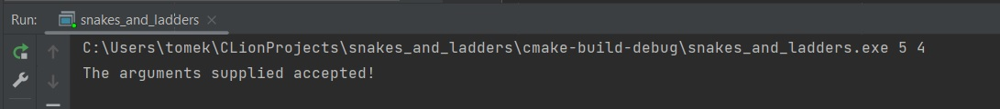
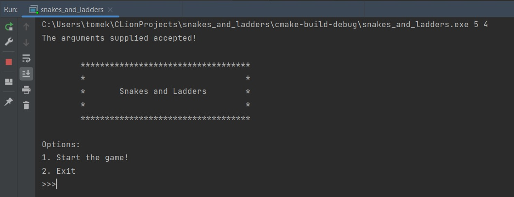
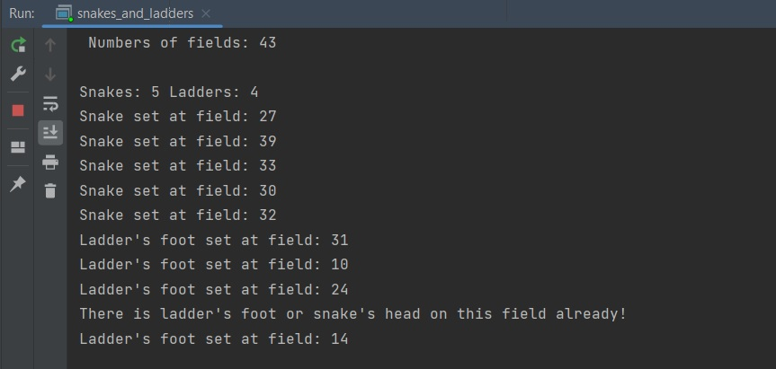
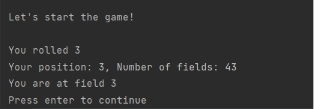
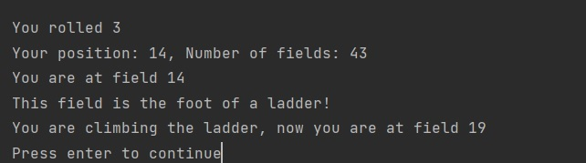

# C Programming

### C Programming module taught at MTU, project name "Snakes and Ladders".

The goal of this project is to implement a C application which can simulate a game of snakes and
ladders. Snakes and ladders is a board game based on random chance. The player must navigate
from the start of the board (square 1) to the final square (square n). The player can move forward
a fixed number of squares based on the outcome of a single die roll; moves between 1 and 6 steps
forward are possible with a 6-sided die.
Along the path there are a fixed number of snakes and ladders. If a player moves to a space
with a foot of ladder they can move directly forward to the space at the other side of the ladder. This
brings them closer to the final square. If a player moves to a space with the head of a snake they must move
directly back to the space at the other side of the snake. This brings them further away from the
nal square.

### Game requirements: 
* Each square on the game board should be a user-defined structure which holds informa-
  tion about the current position on the game board. The program should check if it is
  the final square on the game board, or if it is the bottom of a ladder, or if it is the head
  of a snake.
* The game board size should be randomly set each time the application is run, minimum
  size 32, maximum size 64.
* The entire game board must be represented by a data structure of game square structures
  which you can traverse along, this can be implemented either using an array or a linked
  list.
* game board you should randomly position a user-defined number of snakes and
  a user-defined number of ladders.
* A ladder always transports the player to a higher index (cannot be outside the game
  board). A ladder should transport a player between 1 and 10 squares forward, this
  should be randomly set for each ladder upon board initialisation.
* A snake always transports the player to a lower index (cannot be outside the game
  board). A snake should transport a player between 1 and 10 squares back, this should
  be randomly set for each snake upon board initialisation.
* The last square on the board cannot be occupied by the head of a snake.
* The first square on the board cannot be occupied by the foot of a ladder.
* A square can be occupied by at most the foot of one ladder or the head of one snake.
* The number of snakes and the number of ladders should be provided as two separate
  command line parameters when the function is called.
* Program should initalise a new board (of random length) and it should randomly
  place the number of snakes and ladders as designated by the user.
* Program should then simulate game play by rolling a die (random number generated
  between 1 and 6) and navigating through the board (following snakes and ladders where
  appropriate) until it gets to the final square.
* Once the program terminates a report of the game-play should be printed to a file. This
  can be read by the user to determine the path their player followed through the game.
  This should include the start and end position of each move and whether a snake or a
  ladder was followed.

### The course of the game

The application should be started from the command line with entering two arguments, the first is the number of snakes on the board, the second is the number of ladders that will be on the board.
The number of snakes and ladders can't be less than 1 and more than 5 each, whole numbers only, as in the picture below.

After starting the application, we get information whether the arguments have been correctly entered. If there are too many or too few arguments, or there are invalid argument values, the user will be informed and the program will be terminated.

In the main menu we have two options, play a new game or exit the program. After selecting first option, the specifications of that particular board which was chosen randomly is printed to the user.

The game begins. The first roll of the die has been made, the screen displays what has been rolled on the die. We also see the field we are on and how many fields the board has. To continue the game and make another throw press enter.

As the game progresses, the user is informed about his throws and the square he is on. The player hit the field with the foot of the ladder, the information is displayed and the number of the field the user is moving to.

